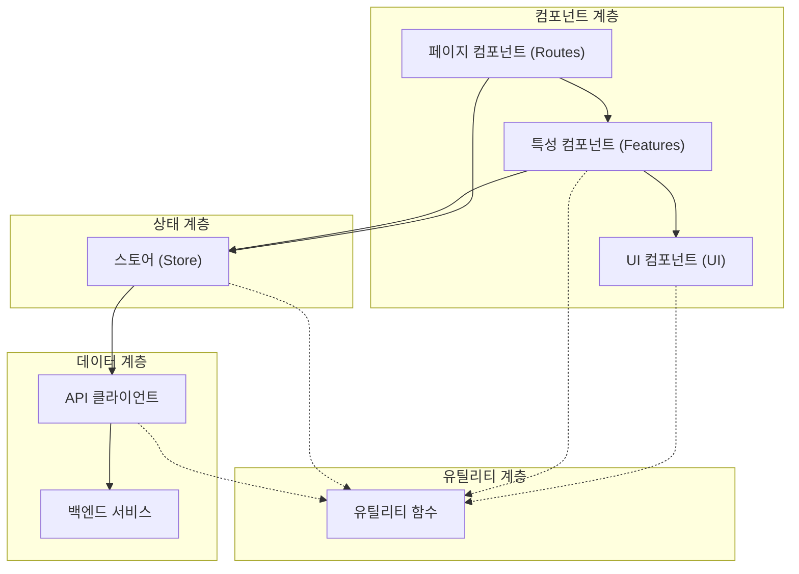

# Svelte 프레임워크 프론트엔드 개발 상세 가이드

## 1. 프로젝트 개요

본 문서는 Svelte 프레임워크를 사용하여 개발할 프론트엔드 서버의 작업지시서입니다. 이 프론트엔드는 다음 두 서버와 통신합니다:
- **Main API 서버** (http://facreport.iptime.org:5008/docs)
- **Auth API 서버** (http://facreport.iptime.org:5009/docs)

## 2. 프로젝트 주요 모델 및 관계

## 3. 프로젝트 구조

```
src/
├── lib/
│   ├── api/                  # API 통신 관련 모듈
│   │   ├── main.ts           # Main API 통신 클라이언트
│   │   ├── auth.ts           # Auth API 통신 클라이언트
│   │   ├── task.ts           # 태스크 API
│   │   ├── image.ts          # 이미지 API
│   │   ├── receipt.ts        # 영수증 API
│   │   └── interceptors.ts   # API 요청/응답 인터셉터
│   ├── components/           # 재사용 가능한 컴포넌트
│   │   ├── ui/               # 기본 UI 컴포넌트
│   │   └── features/         # 기능 중심 컴포넌트
│   ├── stores/               # 상태 관리 스토어
│   │   ├── auth.ts           # 인증 관련 스토어
│   │   ├── app.ts            # 애플리케이션 상태 스토어
│   │   ├── tasks.ts          # 태스크 관련 스토어
│   │   ├── images.ts         # 이미지 관련 스토어
│   │   └── receipts.ts       # 영수증 관련 스토어
│   ├── types/                # 타입 정의
│   │   ├── auth.types.ts     # 인증 관련 타입 정의
│   │   ├── task.types.ts     # 태스크 관련 타입 정의
│   │   ├── image.types.ts    # 이미지 관련 타입 정의
│   │   └── receipt.types.ts  # 영수증 관련 타입 정의
│   ├── utils/                # 유틸리티 함수
│   │   ├── token.ts          # 토큰 관리 유틸리티
│   │   └── error-handler.ts  # 오류 처리 유틸리티
│   └── constants/            # 상수 정의
├── routes/                   # SvelteKit 라우트
│   ├── (auth)/               # 인증 관련 라우트 그룹
│   │   ├── login/+page.svelte
│   │   └── register/+page.svelte
│   ├── (protected)/          # 인증 필요 라우트 그룹
│   │   ├── dashboard/+page.svelte
│   │   ├── tasks/            # 태스크 관련 라우트
│   │   ├── images/           # 이미지 관련 라우트
│   │   └── receipts/         # 영수증 관련 라우트
│   ├── +layout.svelte        # 루트 레이아웃
│   └── +layout.ts            # 레이아웃 로직(인증 체크 등)
├── app.html                  # HTML 템플릿
├── vite.config.ts            # Vite 설정
└── tsconfig.json             # TypeScript 설정
```

## 4. 주요 API 엔드포인트

### Auth API 엔드포인트 (Swagger 기준, Auth API 서버: http://facreport.iptime.org:5009)
- `POST /api/v1/auth/login` - 로그인 (이메일/비밀번호 필요)
- `POST /api/v1/auth/register` - 회원가입
- `POST /api/v1/auth/refresh` - 토큰 갱신
- `GET /api/v1/auth/me` - 현재 사용자 정보 조회
- `POST /api/v1/auth/logout` - 로그아웃

### Task API 엔드포인트 (Swagger 기준, Main API 서버: http://facreport.iptime.org:5008)
- `GET /api/v1/tasks` - 태스크 목록 조회
- `GET /api/v1/tasks/{id}` - 특정 태스크 상세 조회
- `POST /api/v1/tasks` - 새 태스크 생성
- `PUT /api/v1/tasks/{id}` - 태스크 업데이트
- `DELETE /api/v1/tasks/{id}` - 태스크 삭제

### Image API 엔드포인트 (Swagger 기준, Main API 서버: http://facreport.iptime.org:5008)
- `GET /api/v1/main/tasks/{task_id}/images` - 태스크별 이미지 목록 조회
- `GET /api/v1/main/images/{id}` - 특정 이미지 상세 조회
- `POST /api/v1/main/tasks/{task_id}/images` - 이미지 업로드
- `PUT /api/v1/main/images/{id}` - 이미지 정보 업데이트
- `DELETE /api/v1/main/images/{id}` - 이미지 삭제
- `POST /api/v1/main/images/{image_id}/receipt-area` - **영수증 영역 생성**
- `PATCH /api/v1/main/images/{image_id}/receipt-area` - **영수증 영역 선택**
- `POST /api/v1/main/images/{image_id}/ocr` - **영수증의 문자열 추출**


### Receipt API 엔드포인트 (Swagger 기준, Main API 서버: http://facreport.iptime.org:5008)
- `GET /api/v1/main/images/{image_id}/receipts` - 이미지별 영수증 목록 조회
- `GET /api/v1/main/receipts/{id}` - 특정 영수증 상세 조회
- `POST /api/v1/main/images/{image_id}/receipts` - 영수증 정보 추가
- `PUT /api/v1/main/receipts/{id}` - 영수증 정보 업데이트
- `DELETE /api/v1/main/receipts/{id}` - 영수증 정보 삭제
- `POST /api/main/v1/main//receipts/{receipt_id}/gpt-analysis` - **Analyze Receipt With Gpt**


## 5. 개발 규칙 및 지침

### 5.1 코드 구성 원칙

#### 모듈 분리 및 책임 명확화
- **단일 책임 원칙**: 각 모듈은 하나의 책임만 가져야 합니다.
- **API 클라이언트 분리**: 각 엔티티(태스크, 이미지, 영수증)별로 독립적인 API 클라이언트 모듈을 생성합니다.
- **스토어 분리**: 각 엔티티별로 독립적인 스토어를 구현하여 상태 관리를 캡슐화합니다.

#### 순환 참조 방지
- 모듈 간 의존성 방향을 단방향으로 유지합니다(예: 타입 → 유틸리티 → API → 스토어 → 컴포넌트).
- 공통 유틸리티와 타입은 별도 파일로 분리하여 순환 참조를 방지합니다.

### 5.2 타입 정의 규칙

- 모든 데이터 구조는 TypeScript 인터페이스로 명확히 정의합니다.
- API 응답 타입과 내부 사용 타입을 구분합니다.
- 기본값이 있는 속성과 선택적 속성을 명확히 구분합니다.

예제:
```typescript
// 공통 필드 재사용 (공유 속성)
interface BaseEntity {
  id: string;
  created_at: string;
  updated_at: string;
  state: number; // 1: enable, 2: hide, 0: disable
}

// 태스크 인터페이스
export interface Task extends BaseEntity {
  user_id: string;
  task_name: string;
  description: string | null;
  due_date: string | null;
  receipts: any | null;
}
```

### 5.3 API 클라이언트 구현 규칙

- Axios 인스턴스를 사용하여 일관된 설정을 공유합니다.
- 인터셉터를 통해 토큰 관리와 오류 처리를 중앙화합니다.
- 모든 API 함수는 비동기(async/await) 패턴을 사용합니다.
- API 오류 처리를 통일된 방식으로 구현합니다.

예제 구조:
```typescript
// 1. Axios 인스턴스 생성
const taskClient = axios.create({
  baseURL: import.meta.env.PUBLIC_MAIN_API_URL,
  headers: { 'Content-Type': 'application/json' }
});

// 2. 인터셉터 설정
setupApiInterceptors(taskClient);

// 3. API 함수 구현
export const taskAPI = {
  getTasks: async (params) => {
    try {
      const response = await taskClient.get('/tasks', { params });
      return response.data;
    } catch (error) {
      return handleApiError(error, { defaultMessage: '태스크 로드 실패' });
    }
  },
  // 나머지 API 함수들...
};
```

### 5.4 상태 관리 규칙

#### 스토어 구현 원칙
- Svelte의 writable 스토어를 사용하여 상태를 관리합니다.
- 각 스토어는 상태와 액션을 함께 제공하는 구조로 구현합니다.
- 비동기 작업은 스토어 액션 내에서 처리하고, 로딩 및 오류 상태를 함께 관리합니다.

```typescript
// 1. 초기 상태 정의
const initialState = {
  tasks: [],
  currentTask: null,
  loading: false,
  error: null
};

// 2. 스토어 생성
export const taskStore = writable(initialState);

// 3. 스토어 액션 정의
export const taskActions = {
  setLoading: (isLoading) => {
    taskStore.update(state => ({ ...state, loading: isLoading }));
  },
  
  // CRUD 액션들...
  
  // 비동기 데이터 로드 액션
  loadTasks: async () => {
    taskActions.setLoading(true);
    
    try {
      const tasks = await taskAPI.getTasks();
      taskStore.update(state => ({ ...state, tasks, error: null }));
    } catch (error) {
      taskStore.update(state => ({
        ...state, 
        error: error.message || '태스크 로드 실패'
      }));
    } finally {
      taskActions.setLoading(false);
    }
  }
};
```

#### 컴포넌트에서 스토어 사용 규칙
- 컴포넌트에서는 스토어를 구독하여 최신 상태에 접근합니다.
- 컴포넌트에서는 UI 로직만 처리하고, 데이터 로직은 스토어 액션에 위임합니다.

### 5.5 컴포넌트 설계 규칙

#### 컴포넌트 계층 구조
- **UI 컴포넌트**: 순수 스타일링과 기본 동작만 담당하는 재사용 가능한 컴포넌트
- **특성 컴포넌트**: 특정 기능에 특화된 컴포넌트(예: ImageUpload, ReceiptOcrView)
- **페이지 컴포넌트**: 라우트에 연결되는 최상위 컴포넌트

#### 속성(Props) 관리
- 모든 컴포넌트 속성은 타입을 명시적으로 정의합니다.
- 필수 속성과 선택적 속성을 명확히 구분합니다.
- 기본값을 사용하여 컴포넌트의 유연성을 높입니다.

```svelte
<script>
  import { createEventDispatcher } from 'svelte';
  
  // 속성 정의
  export let task; // 필수 속성
  export let editable = false; // 선택적 속성 (기본값 제공)
  
  const dispatch = createEventDispatcher();
  
  function handleEdit() {
    dispatch('edit', { task });
  }
</script>
```

#### 이벤트 처리
- 컴포넌트 간 통신에는 이벤트 디스패치를 사용합니다.
- 이벤트 핸들러 이름은 `handle`로 시작하는 일관된 명명 규칙을 사용합니다.
- 데이터 변경은 부모 컴포넌트에 위임하고, 자식 컴포넌트는 변경 이벤트만 발생시킵니다.

### 5.6 라우터 및 네비게이션 규칙

#### 라우트 구조화
- 인증 여부에 따라 라우트 그룹을 분리합니다(`(auth)`, `(protected)`).
- 엔티티별로 중첩 라우트를 사용합니다(예: `/tasks/[id]`, `/images/[id]`).
- RESTful 구조를 따르는 URL 패턴을 사용합니다.

#### 인증 보호
- 보호된 라우트에 접근 시 인증 상태를 확인하고 미인증 시 리다이렉션합니다.
- 인증 상태 확인 로직은 레이아웃 로직(`+layout.ts`)에 중앙화합니다.

```typescript
export const load: LayoutLoad = async ({ url }) => {
  // 보호된 경로 접근 시 로그인 확인
  const isProtectedRoute = url.pathname.startsWith('/tasks') || 
                          url.pathname.startsWith('/images') || 
                          url.pathname.startsWith('/receipts');
  
  // 인증 상태 확인 및 리다이렉션 처리
  if (isProtectedRoute && !isAuthenticated) {
    throw redirect(307, '/login');
  }
  
  return {};
};
```

### 5.7 오류 처리 규칙

- 모든 API 호출은 try-catch로 감싸서 오류를 처리합니다.
- 오류 메시지를 사용자 친화적으로 변환하는 중앙 처리 메커니즘을 구현합니다.
- HTTP 상태 코드별로 적절한 오류 처리 전략을 구현합니다.
- 오류 발생 시 사용자에게 명확한 피드백을 제공합니다.

```typescript
export function handleApiError(error, options = {}) {
  const { showNotification = true, defaultMessage = '요청 처리 중 오류가 발생했습니다.' } = options;
  
  // HTTP 응답이 있는 경우
  if (error.response) {
    const { status, data } = error.response;
    
    // 오류 코드별 처리
    switch (status) {
      case 400: return '잘못된 요청입니다.';
      case 401: return '인증이 필요합니다. 다시 로그인해주세요.';
      case 403: return '이 작업을 수행할 권한이 없습니다.';
      case 404: return '요청한 리소스를 찾을 수 없습니다.';
      // ... 기타 상태 코드 처리
    }
  }
  
  // 네트워크 오류
  if (error.request && !error.response) {
    return '네트워크 연결을 확인해주세요.';
  }
  
  // 기타 오류
  return defaultMessage;
}
```

### 5.8 이미지 및 파일 처리 규칙

#### 이미지 업로드
- FormData를 사용하여 이미지 파일을 전송합니다.
- 업로드 진행 상태를 사용자에게 표시합니다.
- 이미지 유효성 검사(파일 크기, 형식 등)를 클라이언트 측에서 수행합니다.

#### 이미지 표시
- 이미지 로딩 상태를 처리합니다(로딩 중, 오류 시 대체 이미지 등).
- 고해상도 이미지의 경우 썸네일 또는 최적화된 버전을 사용합니다.
- 반응형 이미지 처리를 위해 적절한 CSS를 적용합니다.

#### OCR 영역 표시
- Canvas API를 사용하여 이미지 위에 영역을 표시합니다.
- 이미지 스케일에 따라 영역 좌표를 적절히 변환합니다.
- 상호작용을 위한 이벤트 핸들러를 구현합니다.

### 5.9 상태와 UI 동기화 규칙

- 로딩 상태, 오류 상태, 성공 상태를 명확히 구분하여 UI에 반영합니다.
- 반응형 UI를 위해 스토어 상태 변화에 따라 UI를 자동으로 업데이트합니다.
- 사용자 상호작용 후 피드백을 즉시 제공합니다.

```svelte
{#if loading}
  <LoadingSpinner />
{:else if error}
  <ErrorMessage message={error} />
{:else if data.length === 0}
  <EmptyState message="데이터가 없습니다." />
{:else}
  <!-- 데이터 표시 UI -->
{/if}
```

### 5.10 성능 최적화 규칙

- 리스트 렌더링 시 `{#each}` 블록에 키를 제공하여 DOM 업데이트를 최적화합니다.
- 큰 이미지의 경우 지연 로딩(lazy loading)을 구현합니다.
- 컴포넌트 라이프사이클 함수(`onMount`, `onDestroy` 등)를 적절히 사용하여 리소스를 관리합니다.
- 불필요한 렌더링을 방지하기 위해 메모이제이션 기법을 활용합니다.

## 6. 기능별 구현 가이드

### 6.1 인증 기능

#### 인증 상태 관리
- 토큰은 localStorage에 안전하게 저장합니다.
- 인증 상태는 중앙 스토어에서 관리하고 전역에서 접근할 수 있게 합니다.
- 토큰 만료 시 자동 갱신 메커니즘을 구현합니다.

#### 로그인/로그아웃 처리
- 로그인 성공 시 토큰을 저장하고 인증 상태를 업데이트합니다.
- 로그아웃 시 토큰을 제거하고 인증 상태를 초기화합니다.
- 보호된 경로에 미인증 접근 시 로그인 페이지로 리다이렉션합니다.

### 6.2 태스크 관리 기능

#### 태스크 목록 및 필터링
- 페이지네이션, 정렬, 필터링 기능을 구현합니다.
- 검색 기능으로 태스크를 쉽게 찾을 수 있게 합니다.
- 상태별 태스크 구분(활성, 숨김, 비활성)을 시각적으로 표현합니다.

#### 태스크 CRUD 작업
- 태스크 생성, 조회, 수정, 삭제 기능을 구현합니다.
- 태스크에 마감일 설정 및 알림 기능을 추가합니다.
- 태스크와 연결된 이미지 목록을 효과적으로 표시합니다.

### 6.3 이미지 관리 기능

#### 이미지 업로드 및 표시
- 드래그 앤 드롭 기능을 포함한 이미지 업로드 컴포넌트를 구현합니다.
- 이미지 썸네일 그리드 레이아웃으로 효율적인 탐색 경험을 제공합니다.
- 이미지 메타데이터(파일 크기, 날짜 등)를 표시합니다.

#### 이미지 처리
- 이미지 편집 기능(회전, 자르기 등)을 구현합니다.
- 이미지별 영수증 OCR 영역을 시각적으로 표시합니다.
- 이미지와 태스크 간의 연결 관계를 관리합니다.

### 6.4 영수증 관리 기능

#### 영수증 데이터 표시
- 영수증 OCR 데이터를 구조화된 형태로 표시합니다.
- 영수증 영역을 이미지 위에 하이라이트하여 시각적으로 구분합니다.
- 영수증 메타데이터(상점명, 날짜, 금액 등)를 효과적으로 표시합니다.

#### 영수증 편집 및 검증
- 영수증 데이터 수동 편집 기능을 구현합니다.
- 영수증 데이터의 유효성 검사(금액 계산 등)를 구현합니다.
- 영수증 처리 상태를 관리합니다(인식 중, 검증 필요, 검증 완료 등).

## 7. 개발 일정 및 작업 계획


### 세부 작업 일정

#### 1일차: 프로젝트 설정 및 기본 구조
- SvelteKit 프로젝트 생성
- 의존성 설치(axios, date-fns, uuid 등)
- TypeScript 설정
- 프로젝트 구조 설정
- 환경 변수 설정(.env)

#### 2일차: API 클라이언트 및 타입 구현
- 인증, 태스크, 이미지, 영수증 관련 타입 정의
- API 클라이언트 모듈 구현
- 인터셉터 및 오류 처리 유틸리티 구현
- 스토어 구조 설계 및 기본 구현

#### 3일차: 인증 및 레이아웃 구현
- 인증 페이지(로그인, 회원가입) 구현
- 레이아웃 컴포넌트(사이드바, 네비게이션) 구현
- 라우트 보호 로직 구현
- 기본 UI 컴포넌트 라이브러리 구현

#### 4일차: 태스크 관리 기능 구현
- 태스크 목록, 상세, 생성, 편집 페이지 구현
- 태스크 필터링 및 정렬 기능 구현
- 태스크 상태 관리 구현
- 태스크-이미지 연결 관계 구현

#### 5일차: 이미지 관리 기능 구현
- 이미지 업로드 컴포넌트 구현
- 이미지 갤러리 및 상세 보기 구현
- 이미지 메타데이터 표시 기능 구현
- 이미지 처리 상태 관리 구현

#### 6일차: 영수증 관리 기능 구현
- 영수증 OCR 영역 표시 컴포넌트 구현
- 영수증 데이터 표시 및 편집 기능 구현
- 영수증 유효성 검사 기능 구현
- 영수증 처리 워크플로우 구현

#### 7일차: 마무리 및 배포 준비
- 대시보드 페이지 구현(통계, 요약 정보)
- 종합 테스트 및 버그 수정
- 성능 최적화 작업
- 배포 설정 및 문서화

## 8. 품질 관리 및 개발 방법론

### 8.1 코드 품질 관리

- **ESLint 및 Prettier**: 일관된 코드 스타일과 품질을 유지합니다.
- **TypeScript 엄격 모드**: 타입 안전성을 높여 런타임 오류를 줄입니다.
- **코드 리뷰**: 개발 과정에서 정기적인 코드 리뷰를 통해 품질을 관리합니다.

### 8.2 테스트 전략

- **컴포넌트 테스트**: 핵심 UI 컴포넌트에 대한 단위 테스트를 구현합니다.
- **통합 테스트**: API 통신 및 주요 사용자 흐름에 대한 통합 테스트를 구현합니다.
- **수동 테스트**: 다양한 디바이스와 브라우저에서 UI 동작을 검증합니다.

## 8.3 배포 전략

- **CI/CD 파이프라인**: 자동화된 빌드, 테스트, 배포 프로세스를 구축합니다.
- **환경별 설정**: 개발, 테스트, 프로덕션 환경에 맞는 설정을 분리 관리합니다.
- **점진적 배포**: 주요 기능은 카나리 배포 전략으로 위험을 최소화합니다.
- **롤백 계획**: 배포 후 문제 발생 시 신속하게 롤백할 수 있는 전략을 수립합니다.

### 8.4 애자일 개발 방법론

- **스프린트 계획**: 1일 단위로 명확한 목표와 완료 기준을 설정합니다.
- **일일 스탠드업**: 진행 상황을 공유하고 장애물을 신속히 해결합니다.
- **회고**: 각 스프린트 마지막에 개선점을 도출하고 다음 스프린트에 반영합니다.
- **지속적 개선**: 사용자 피드백을 빠르게 수집하여 제품에 반영합니다.


## 9. 설계 원칙 및 아키텍처 패턴

### 9.1 컴포넌트 계층 아키텍처




### 9.2 주요 설계 원칙

#### 관심사 분리 (Separation of Concerns)
- **프레젠테이션 로직**: UI 컴포넌트에서 처리
- **비즈니스 로직**: 스토어와 유틸리티 함수에서 처리
- **데이터 접근 로직**: API 클라이언트에서 처리

#### 단방향 데이터 흐름
- 상태는 스토어에서 관리되며 컴포넌트로 전파됩니다.
- 컴포넌트는 스토어 액션을 통해서만 상태를 변경할 수 있습니다.
- 이벤트는 아래에서 위로, 데이터는 위에서 아래로 흐릅니다.

#### 재사용성과 합성
- 작고 단일 목적의 컴포넌트를 만들고 이를 조합하여 복잡한 UI를 구성합니다.
- 특수 목적 컴포넌트보다 일반적이고 유연한 컴포넌트를 선호합니다.
- 고차 컴포넌트 패턴을 사용하여 기능을 재사용합니다.

### 9.3 반응형 디자인 원칙

- **모바일 우선 설계**: 모바일 화면부터 설계를 시작하고 점진적으로 확장합니다.
- **유동적 그리드 시스템**: 고정 너비가 아닌 상대적 크기로 레이아웃을 구성합니다.
- **미디어 쿼리 브레이크포인트**: 표준화된 브레이크포인트를 사용하여 다양한 화면 크기를 지원합니다.
- **접근성 고려**: WCAG 지침을 준수하여 모든 사용자가 접근 가능한 UI를 구현합니다.

## 10. 주요 UI/UX 가이드라인

### 10.1 시각적 디자인 일관성

#### 색상 체계
- **기본 색상**: #4A90E2 (파란색)
- **보조 색상**: #F5F5F5 (회색), #2C3E50 (짙은 회색)
- **액센트 색상**: #2ECC71 (녹색), #E74C3C (빨간색), #F39C12 (주황색)
- **상태 색상**:
  * 성공: #2ECC71
  * 경고: #F39C12
  * 오류: #E74C3C
  * 정보: #4A90E2

#### 타이포그래피
- **기본 글꼴**: Segoe UI, Tahoma, Geneva, Verdana, sans-serif
- **제목 크기**: H1(24px), H2(20px), H3(18px), H4(16px)
- **본문 텍스트**: 14px
- **작은 텍스트**: 12px

#### 공간 및 여백
- 일관된 간격 시스템 사용: 4px, 8px, 16px, 24px, 32px, 48px, 64px
- 중요한 요소는 충분한 여백으로 강조
- 관련 요소는 그룹화하여 시각적 계층 구조 형성

### 10.2 상호작용 패턴

#### 입력 요소
- 모든 입력 필드에 명확한 라벨 제공
- 실시간 유효성 검사와 피드백 표시
- 오류 메시지는 구체적이고 해결 방법 제시
- 필수 입력 필드는 시각적으로 표시 (예: 별표)

#### 버튼 및 액션
- 주요 액션은 강조 버튼으로 표시
- 보조 액션은 텍스트 링크 또는 아웃라인 버튼으로 표시
- 파괴적 액션(삭제 등)은 확인 단계 추가
- 액션 버튼의 상태 표시 (활성, 비활성, 호버, 로딩 등)

#### 피드백 및 상태 표시
- 작업 진행 상태를 명확히 표시 (로딩 스피너, 진행 표시줄 등)
- 액션 성공/실패 시 토스트 메시지 또는 알림 표시
- 빈 상태(empty state)에 대한 친절한 안내 제공
- 사용자 행동에 대한 즉각적인 시각적 피드백 제공

### 10.3 페이지 레이아웃 패턴

#### 대시보드 레이아웃
- 주요 지표는 상단에 카드 형태로 표시
- 최근 활동 및 요약 정보를 중간에 배치
- 관련 항목(태스크, 이미지) 연결에 빠르게 접근 가능한 링크 제공

#### 목록 페이지 레이아웃
- 필터, 정렬, 검색 옵션을 상단에 배치
- 페이지네이션 또는 무한 스크롤 구현
- 항목별 주요 액션(보기, 편집, 삭제)에 쉽게 접근 가능하도록 설계

#### 상세 페이지 레이아웃
- 주요 정보를 상단에 표시
- 관련 데이터를 논리적 섹션으로 그룹화
- 주요 액션 버튼은 항상 접근 가능하도록 배치 (고정 위치 또는 상단에 배치)

## 11. 성능 최적화 및 사용자 경험 향상

### 11.1 성능 최적화 전략

#### 로딩 최적화
- 코드 분할(Code Splitting)을 통한 초기 로딩 시간 단축
- 핵심 리소스의 사전 로딩(Preloading)
- 라우트 기반 지연 로딩 구현

#### 렌더링 최적화
- 불필요한 리렌더링 방지
- `{#each}` 블록에 키를 사용하여 DOM 업데이트 최적화
- 고비용 계산 결과 메모이제이션

#### 네트워크 최적화
- API 응답 캐싱
- 데이터 요청 배치 처리
- 필요한 데이터만 선택적으로 요청 (필드 필터링)

### 11.2 사용자 경험 향상 기법

#### 인지된 성능 향상
- 스켈레톤 로더 사용
- 낙관적 UI 업데이트 구현
- 백그라운드 데이터 프리페칭

#### 점진적 향상
- 기본 기능 우선 로드 후 부가 기능 점진적 활성화
- 오프라인 지원 및 상태 복원
- 불안정한 네트워크 환경에서도 작동하는 복원력 있는 UI

#### 접근성 및 포용성
- 키보드 네비게이션 지원
- 스크린 리더 호환성 보장
- 고대비 모드 및 다양한 글꼴 크기 지원

## 12. 결론 및 추가 고려사항

이 작업지시서는 Svelte 프레임워크를 사용하여 태스크, 이미지, 영수증 관리 시스템의 프론트엔드 구현에 필요한 구체적인 지침을 제공했습니다. 모듈화된 구조, 일관된 개발 규칙, 명확한 책임 분리를 통해 유지보수가 용이한 코드베이스를 구축할 수 있습니다.

### 확장 고려사항

1. **다국어 지원**: 국제화(i18n) 라이브러리 통합 고려
2. **테마 지원**: 다크 모드 외에 추가 테마 옵션 제공
3. **사용자 설정**: 개인화된 대시보드 및 UI 설정 기능
4. **고급 영수증 분석**: 차트 및 그래프로 영수증 데이터 시각화
5. **협업 기능**: 다중 사용자 협업 및 공유 기능 추가
